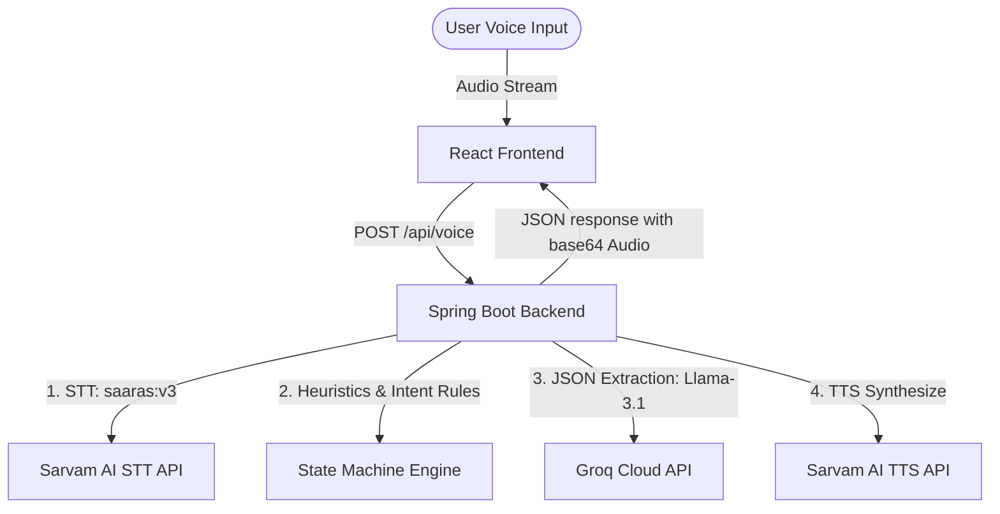
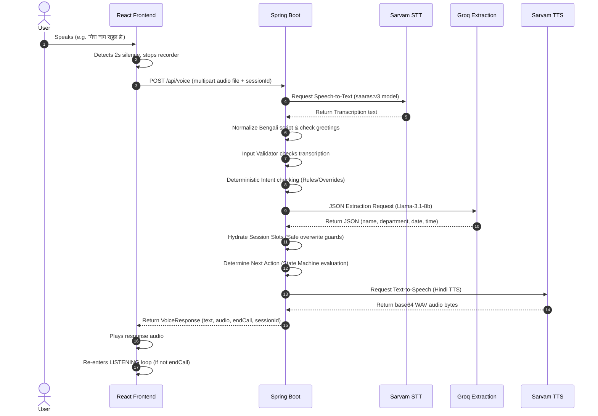

# Architecture Documentation

This document describes the architectural layout, core subsystems, and communication flows of the **VoiceAIAgentPro** platform.

---

## 🏗 Subsystems Overview

VoiceAIAgentPro is built on a decoupled, fullstack architecture:

### 1. Frontend Subsystem (`/frontend`)
- **Technology Stack:** React 18, Vite, TypeScript, Tailwind CSS, shadcn-ui.
- **Audio Processing:** Uses standard browser `navigator.mediaDevices.getUserMedia` and `MediaRecorder` API to capture microphone input.
- **Continuous Mode Voice Engine:** Monitor average audio volume level to automatically detect speech activity and stop recording after a silence delay (~2 seconds), bypassing manual "click-to-talk" requirements.
- **Audio Playback:** Automatically handles base64-encoded WAV files returned by the backend, triggering consecutive voice-loops when continuous conversation is enabled.

### 2. Backend Subsystem (`/backend`)
- **Technology Stack:** Java 17, Spring Boot 3.2.x, Spring Web, Maven.
- **Session Manager:** Automatically creates and stores session states (`SessionState`) in-memory to persist user records across voice inputs.
- **Integrations:**
  - **Sarvam AI STT:** Converts user audio files into Hindi/Hinglish text transcription.
  - **Groq Cloud (Llama 3.1 8B):** Invoked via JSON mode formats to extract name, department, date, time, and boolean classification flags.
  - **Sarvam AI Hindi TTS:** Generates high-quality base64 audio binaries for the speech response text.

---

## 🔄 Voice Processing Lifecycle & State Machine

When a user speaks into the microphone, the following lifecycle triggers:

---

## 📋 Session States & Intent Machine

The session transition flows through four main modes defined in `SessionState.Mode`:

| Mode | Trigger Condition | Exit / Transition Condition |
|---|---|---|
| **BOOKING** | Default starting state. | Transition to `CONFIRMATION` once Name, Department, Date, and Time slots are fully populated. |
| **CONFIRMATION** | Automatically entered when all 4 slots are hydrated. | Transition to `POST_CONFIRM` if user confirms (`isConfirming` or `CONTINUE` intent). Reverts to `BOOKING` if user rejects. |
| **POST_CONFIRM** | Entered after successful user confirmation. | Persistent state. Answers queries ("मेरा अपॉइंटमेंट कब है?") from the locked slot values or routes to `RESCHEDULE`. |
| **RESCHEDULE** | Entered if a reschedule command ("तारीख़ बदलनी है") is detected during confirmation or post-confirmation. | Resets date, time, doctor, and enters `BOOKING` state specifically targeting the `date` prompt. |

### Deterministic Override Safeguards

To achieve production-grade conversational stability, the system uses a **Fast Path Override Engine** that overrides LLM outputs under specific conditions:

1. **Greeting Guard:** The receptionist Greeting is sent once at the very start of the conversation, bypassing LLM generation to guarantee a polite welcoming response.
2. **Loop Prevention (Repeat Count Guard):** If the user is prompted for the same information (e.g., date) more than 2 times, the engine halts LLM-based parsing and force-accepts the raw normalized transcription to prevent conversational deadlocks.
3. **Intent Hardcoding:** Negative confirmations (e.g., "नहीं", "कन्फर्म नहीं") in Confirmation Mode instantly reset time/doctor slots without invoking LLM classification.
4. **Post-Confirm Snapshot Frozen:** In `POST_CONFIRM` mode, slot values are frozen. Any queries are resolved directly from the session model, preventing the LLM from hallucinating new appointment dates during subsequent chit-chat.
